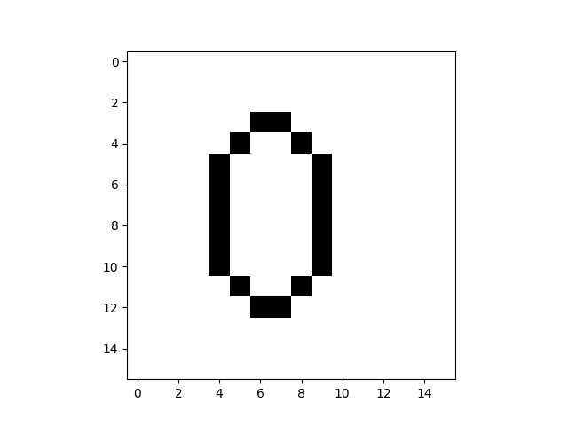
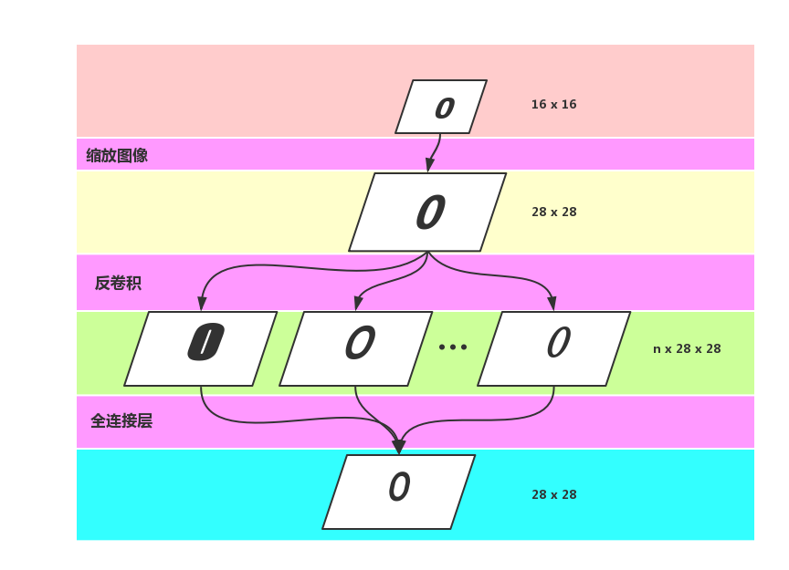
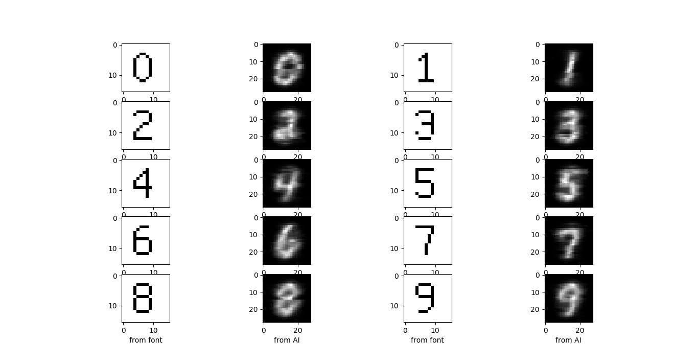

# AINumber
## 使用神经网络生成手写数字
使用神经网络自动生成手写风格的数字，采用MNIST数据集进行训练，因为MNIST数据集并不是一个人的笔迹，所以只是用部分数据进行训练。具体的步骤如下：  
1、生成用于输入神经网络的图像，这步使用点阵字体生成，生成的图片如图1：

2、使用点阵字体图片和MNIST数据集进行训练，输入为点阵字体图片，输出与MNIST数据集进行比较，损失函数使用`MSE`，即两幅图片的欧氏距离。
3、训练结构如图2所示，首先将图片缩放到MNIST的大小，然后对点阵字体图片进行反卷积，反卷积会生成`n`张`28x28`的图片，使用全连接层将它们合并成一张，除了上述主要流程外，输出处还包括sigmoid处理等。

## 生成结果

## 文件
`autoencoder.py`是训练文件，`make.py`是测试文件，`生成字`文件夹用于生成点阵字体图片。
